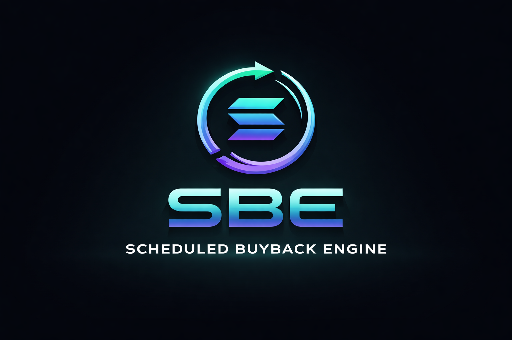

# Scheduled Buyback Engine (SBE)



## Table of Contents

- [Introduction](#introduction)
- [Design Goals](#design-goals)
- [High-Level Architecture](#high-level-architecture)
- [Scheduling Models](#scheduling-models)
- [Execution Flow](#execution-flow)
- [Treasury Routing Logic](#treasury-routing-logic)
- [Bags Integration](#bags-integration)
- [Security Model](#security-model)
- [Non-Goals](#non-goals)
- [Example Configurations](#example-configurations)
- [Deployment Flow](#deployment-flow)
- [Operational Considerations](#operational-considerations)
- [FAQ](#faq)
- [Disclaimer](#disclaimer)

---

## Introduction

Scheduled Buyback Engine (SBE) is a deterministic, on-chain execution system for converting protocol revenue into scheduled buybacks and distributions. It is designed to remove randomness, discretion, and manual intervention from buyback mechanisms.

### What is a Deterministic Buyback?

A deterministic buyback operates according to predefined rules encoded in smart contract logic. Given a specific protocol state and timestamp, any observer can calculate whether a buyback should execute and what parameters it will use. There is no discretionary timing, no manual triggering, and no variable execution logic based on market conditions or human judgment.

### Why Manual or Discretionary Buybacks Fail

Traditional buyback mechanisms suffer from several failure modes:

1. **Execution Risk**: Manual buybacks depend on human availability and operational overhead.
2. **Timing Uncertainty**: Market participants cannot predict when buybacks will occur, leading to front-running and price manipulation.
3. **Trust Surface**: Discretionary systems require trusting a treasury manager or multisig to execute as promised.
4. **Verification Gap**: Off-chain or manual processes cannot be independently verified by protocol participants.
5. **Gaming Potential**: Advance knowledge of buyback timing creates asymmetric information advantages.

SBE addresses these issues through schedule-based, verifiable execution.

### What SBE Does

- Accepts revenue inputs from protocol operations
- Routes funds according to predefined percentage splits
- Executes buybacks on deterministic schedules
- Optionally distributes proceeds to token holders via composable systems
- Provides on-chain audit trails for all operations
- Enforces execution atomicity and slippage bounds

### What SBE Does Not Do

- Provide price guarantees or yield promises
- Custody user funds or manage external wallets
- Make discretionary market decisions
- Implement market making or liquidity provision strategies
- Calculate or advertise APY or return metrics
- Offer financial advice or investment recommendations

SBE is execution infrastructure. It is not a financial product.

---

## Design Goals

### Determinism

All execution logic must be derivable from on-chain state and time. Given the current block height, timestamp, and treasury balance, any observer should be able to calculate:

- Whether a trigger condition has been met
- The exact parameters of the next execution
- The routing destinations and amounts

No randomness. No discretion. No oracle dependencies for core execution logic.

### Composability

SBE is designed as a modular component that integrates with other protocol infrastructure:

- Revenue sources are abstracted: any wallet or program can route funds to SBE
- Distribution targets are pluggable: SBE can call arbitrary distribution contracts
- Buyback routers are configurable: integration with any DEX or swap protocol
- State updates are event-driven: other programs can react to SBE executions

The system does not make assumptions about upstream or downstream components beyond defined interfaces.

### Minimal Trust Surface

Trust requirements are limited to:

- The integrity of the Solana runtime
- The correctness of the SBE program code
- The configuration parameters set at initialization

SBE does not require:

- Trusting a treasury manager to execute on schedule
- Trusting an oracle for execution triggers (time-based schedules use block timestamps)
- Trusting external systems to report accurate state

Admin keys have strictly limited capabilities defined in the security model section.

### On-Chain Verifiability

Every execution produces verifiable state changes:

- Treasury balance deltas
- Swap execution details (input/output amounts, slippage)
- Distribution amounts and recipients
- Schedule state updates (last execution timestamp, execution counter)

All events are emitted as program logs parseable by indexers and analytics tools.

### Schedule-Based Execution

Execution is driven by time or threshold conditions encoded in the schedule configuration. Common patterns:

- Time-based: execute every N seconds
- Threshold-based: execute when treasury reaches X tokens
- Hybrid: execute when either condition is met

Schedules are immutable once set, or mutable only through governed admin operations with time delays.

### Chain-Agnostic Architecture Assumptions

While SBE is implemented for Solana, the design principles are portable:

- Schedule evaluation logic is portable to any chain with block timestamps
- Treasury routing is a common pattern across EVM and non-EVM chains
- Atomic execution guarantees are achievable through different mechanisms (Solana CPIs, EVM `CALL` operations, etc.)

The Solana implementation prioritizes low execution cost and high throughput, but the model is not Solana-specific.

---

## High-Level Architecture

SBE consists of five primary components:

```
┌─────────────────────────────────────────────────────────────────┐
│                        Revenue Sources                          │
│  (Protocol fees, transaction taxes, royalty streams, etc.)     │
└────────────────┬────────────────────────────────────────────────┘
                 │
                 │  SOL/SPL Token Flow
                 │
                 ▼
┌─────────────────────────────────────────────────────────────────┐
│                      Treasury Router                            │
│  - Receives incoming revenue                                    │
│  - Validates source and amount                                  │
│  - Emits accumulation events                                    │
└────────────────┬────────────────────────────────────────────────┘
                 │
                 │  Balance Query
                 │
                 ▼
┌─────────────────────────────────────────────────────────────────┐
│                      Schedule Engine                            │
│  - Evaluates time/threshold conditions                          │
│  - Determines if execution should trigger                       │
│  - Computes execution parameters                                │
└────────────────┬────────────────────────────────────────────────┘
                 │
                 │  Trigger Signal
                 │
                 ▼
┌─────────────────────────────────────────────────────────────────┐
│                    Execution Controller                         │
│  - Validates trigger conditions                                 │
│  - Atomically executes configured actions                       │
│  - Updates schedule state                                       │
└────┬───────────────────────────────┬────────────────────────────┘
     │                               │
     │  Buyback Path                 │  Distribution Path
     │                               │
     ▼                               ▼
┌─────────────────────┐       ┌──────────────────────────────────┐
│  Buyback Router     │       │  Distribution Targets            │
│  - DEX integration  │       │  - LP addition                   │
│  - Slippage checks  │       │  - Bags distribution (optional)  │
│  - Swap execution   │       │  - Treasury reserves             │
└─────────────────────┘       └──────────────────────────────────┘
```

### Component Descriptions

**Revenue Sources**: Any program or wallet that sends tokens to the SBE treasury. SBE does not enforce source restrictions at the protocol level; this is a configuration concern for the deploying protocol.

**Treasury Router**: A program-controlled account that accumulates revenue. The router emits events on incoming transfers and maintains a running balance. It does not implement complex logic; it is a buffer with accounting.

**Schedule Engine**: Pure logic that evaluates whether current on-chain state meets execution criteria. It reads the treasury balance, current block timestamp, and last execution state to determine if a trigger has occurred.

**Execution Controller**: The core state machine that performs atomic operations when triggered. It validates preconditions, executes configured actions through CPIs, and updates internal state.

**Buyback Router**: Abstraction over DEX interactions. Default implementation uses Jupiter or Orca aggregators on Solana. Enforces slippage bounds and minimum output amounts. Reverts entire transaction if conditions are not met.

**Distribution Targets**: Configurable endpoints for fund allocation. May include LP pools, holder distribution contracts (via Bags), or reserve wallets.

---

## Scheduling Models

SBE supports three primary scheduling models. The selected model is determined at initialization and encoded in the schedule configuration account.

### Time-Based Scheduling

Execution occurs at fixed time intervals.

**Configuration**:

```rust
pub struct TimeBasedSchedule {
    /// Interval between executions (seconds)
    pub interval_seconds: u64,
    /// Timestamp of last execution
    pub last_execution_ts: i64,
    /// Minimum balance required to execute
    pub min_balance_threshold: u64,
}
```

**Evaluation Logic**:

```rust
fn should_execute_time_based(
    schedule: &TimeBasedSchedule,
    current_ts: i64,
    treasury_balance: u64,
) -> bool {
    let elapsed = current_ts - schedule.last_execution_ts;
    let interval_met = elapsed >= schedule.interval_seconds as i64;
    let balance_met = treasury_balance >= schedule.min_balance_threshold;
    
    interval_met && balance_met
}
```

**Use Case**: Protocols with steady revenue streams that prefer predictable execution windows. Example: buyback every 24 hours at 00:00 UTC.

**Trade-offs**:
- Predictable for market participants (can be front-run)
- May execute with low treasury balance if threshold is too low
- Requires monitoring to ensure execution occurs (permissionless trigger model mitigates this)

### Threshold-Based Scheduling

Execution occurs when the treasury balance exceeds a predefined threshold.

**Configuration**:

```rust
pub struct ThresholdBasedSchedule {
    /// Balance threshold that triggers execution
    pub balance_threshold: u64,
    /// Minimum time between executions (prevents spam)
    pub min_interval_seconds: u64,
    /// Timestamp of last execution
    pub last_execution_ts: i64,
}
```

**Evaluation Logic**:

```rust
fn should_execute_threshold_based(
    schedule: &ThresholdBasedSchedule,
    current_ts: i64,
    treasury_balance: u64,
) -> bool {
    let balance_met = treasury_balance >= schedule.balance_threshold;
    let min_interval_elapsed = (current_ts - schedule.last_execution_ts) 
        >= schedule.min_interval_seconds as i64;
    
    balance_met && min_interval_elapsed
}
```

**Use Case**: Protocols with variable revenue that want to execute when sufficient capital accumulates. Example: buyback when treasury reaches 100 SOL.

**Trade-offs**:
- Execution frequency varies with revenue rate
- More resistant to front-running (threshold crossing is less predictable)
- May delay execution during low-revenue periods

### Hybrid Scheduling

Execution occurs when either time interval OR balance threshold is met (whichever comes first).

**Configuration**:

```rust
pub struct HybridSchedule {
    /// Time interval option
    pub interval_seconds: u64,
    /// Balance threshold option
    pub balance_threshold: u64,
    /// Timestamp of last execution
    pub last_execution_ts: i64,
    /// Minimum balance required for time-based trigger
    pub min_balance_for_time_trigger: u64,
}
```

**Evaluation Logic**:

```rust
fn should_execute_hybrid(
    schedule: &HybridSchedule,
    current_ts: i64,
    treasury_balance: u64,
) -> bool {
    let time_elapsed = (current_ts - schedule.last_execution_ts) 
        >= schedule.interval_seconds as i64;
    let time_trigger = time_elapsed 
        && treasury_balance >= schedule.min_balance_for_time_trigger;
    
    let threshold_trigger = treasury_balance >= schedule.balance_threshold;
    
    time_trigger || threshold_trigger
}
```

**Use Case**: Protocols that want guaranteed minimum execution frequency (via time) with opportunistic execution on high revenue periods (via threshold).

**Trade-offs**:
- More complex configuration
- Provides both predictability and responsiveness
- Requires careful parameter tuning to avoid unintended execution patterns

---

## Execution Flow

The execution flow is a multi-stage process with atomicity guarantees at each stage.

### Stage 1: Revenue Accumulation

Revenue flows into the treasury account from various sources. SBE does not restrict sources; this is a deployment configuration decision.

```rust
/// Pseudo-event emitted on treasury deposit
pub struct RevenueAccumulated {
    pub source: Pubkey,
    pub amount: u64,
    pub token_mint: Pubkey,
    pub timestamp: i64,
    pub new_balance: u64,
}
```

The treasury account is a standard SPL token account owned by the SBE program. Deposits are standard SPL token transfers.

### Stage 2: Schedule Evaluation

Any actor can call the `evaluate_schedule` instruction. This is a read-only operation that computes whether execution should occur.

```rust
pub fn evaluate_schedule(ctx: Context<EvaluateSchedule>) -> Result<bool> {
    let schedule = &ctx.accounts.schedule_config;
    let treasury = &ctx.accounts.treasury;
    let clock = Clock::get()?;
    
    let should_execute = match schedule.schedule_type {
        ScheduleType::TimeBased => {
            should_execute_time_based(
                &schedule.time_config,
                clock.unix_timestamp,
                treasury.amount,
            )
        },
        ScheduleType::ThresholdBased => {
            should_execute_threshold_based(
                &schedule.threshold_config,
                clock.unix_timestamp,
                treasury.amount,
            )
        },
        ScheduleType::Hybrid => {
            should_execute_hybrid(
                &schedule.hybrid_config,
                clock.unix_timestamp,
                treasury.amount,
            )
        },
    };
    
    emit!(ScheduleEvaluated {
        should_execute,
        treasury_balance: treasury.amount,
        timestamp: clock.unix_timestamp,
    });
    
    Ok(should_execute)
}
```

This function is permissionless. Anyone can call it to check execution readiness.

### Stage 3: Trigger Validation

If evaluation returns true, any actor can call the `execute_buyback` instruction. The instruction performs validation before proceeding.

```rust
pub fn execute_buyback(ctx: Context<ExecuteBuyback>) -> Result<()> {
    let schedule = &mut ctx.accounts.schedule_config;
    let treasury = &ctx.accounts.treasury;
    let clock = Clock::get()?;
    
    // Re-validate trigger condition
    let should_execute = evaluate_trigger_condition(schedule, treasury, &clock)?;
    require!(should_execute, ErrorCode::TriggerConditionNotMet);
    
    // Check minimum balance
    require!(
        treasury.amount >= schedule.min_execution_amount,
        ErrorCode::InsufficientTreasuryBalance
    );
    
    // Proceed to execution
    execute_atomic_actions(ctx)?;
    
    // Update schedule state
    schedule.last_execution_ts = clock.unix_timestamp;
    schedule.execution_count += 1;
    
    emit!(ExecutionCompleted {
        execution_id: schedule.execution_count,
        timestamp: clock.unix_timestamp,
        treasury_balance_before: treasury.amount,
    });
    
    Ok(())
}
```

The re-validation ensures that the trigger condition is still met at execution time, preventing stale triggers from executing.

### Stage 4: Atomic Execution

The execution phase performs all configured actions in a single transaction. If any action fails, the entire transaction reverts.

```rust
fn execute_atomic_actions(ctx: Context<ExecuteBuyback>) -> Result<()> {
    let config = &ctx.accounts.execution_config;
    let treasury = &ctx.accounts.treasury;
    
    let total_amount = treasury.amount;
    
    // Calculate amounts for each action
    let buyback_amount = (total_amount * config.buyback_percentage) / 10000;
    let lp_amount = (total_amount * config.lp_percentage) / 10000;
    let distribution_amount = (total_amount * config.distribution_percentage) / 10000;
    
    // Validate split adds up to 100% or less
    let total_allocated = buyback_amount + lp_amount + distribution_amount;
    require!(total_allocated <= total_amount, ErrorCode::InvalidSplit);
    
    // Execute buyback via router
    if buyback_amount > 0 {
        execute_buyback_swap(
            &ctx.accounts.swap_router,
            &ctx.accounts.treasury,
            buyback_amount,
            config.min_output_amount,
        )?;
    }
    
    // Add to LP
    if lp_amount > 0 {
        add_liquidity(
            &ctx.accounts.lp_pool,
            &ctx.accounts.treasury,
            lp_amount,
        )?;
    }
    
    // Distribute to holders
    if distribution_amount > 0 {
        distribute_to_bags(
            &ctx.accounts.bags_program,
            &ctx.accounts.treasury,
            distribution_amount,
        )?;
    }
    
    emit!(ActionsExecuted {
        buyback_amount,
        lp_amount,
        distribution_amount,
    });
    
    Ok(())
}
```

All CPIs (Cross-Program Invocations) are executed within the same transaction, ensuring atomicity.

### Stage 5: State Update

After successful execution, the schedule state is updated to reflect the new execution count and timestamp.

```rust
schedule.last_execution_ts = clock.unix_timestamp;
schedule.execution_count += 1;
schedule.total_volume_processed += total_amount;

emit!(StateUpdated {
    execution_count: schedule.execution_count,
    last_execution_ts: schedule.last_execution_ts,
    total_volume_processed: schedule.total_volume_processed,
});
```

This state is used for subsequent schedule evaluations.

---

## Treasury Routing Logic

The treasury routing system determines how accumulated revenue is allocated across different destinations.

### Configuration Structure

```rust
pub struct RoutingConfig {
    /// Percentage allocated to buyback (basis points, 0-10000)
    pub buyback_percentage: u16,
    
    /// Percentage allocated to LP addition (basis points, 0-10000)
    pub lp_percentage: u16,
    
    /// Percentage allocated to holder distribution (basis points, 0-10000)
    pub distribution_percentage: u16,
    
    /// Percentage kept in treasury reserve (basis points, 0-10000)
    pub reserve_percentage: u16,
    
    /// Minimum output for buyback swaps (slippage protection)
    pub min_buyback_output_bps: u16,
    
    /// Maximum slippage allowed (basis points)
    pub max_slippage_bps: u16,
}
```

All percentages are expressed in basis points (1 basis point = 0.01%). The sum of all percentages must equal 10000 (100%).

### Validation Logic

```rust
pub fn validate_routing_config(config: &RoutingConfig) -> Result<()> {
    let total = config.buyback_percentage
        + config.lp_percentage
        + config.distribution_percentage
        + config.reserve_percentage;
    
    require!(total == 10000, ErrorCode::InvalidRoutingConfig);
    require!(config.max_slippage_bps <= 1000, ErrorCode::SlippageTooHigh);
    
    Ok(())
}
```

Slippage is capped at 10% (1000 basis points) as a safety mechanism. Most configurations use much lower values (e.g., 50-100 bps).

### Buyback Path Implementation

The buyback path integrates with Solana DEX aggregators via a standardized interface.

```rust
pub fn execute_buyback_swap(
    router: &AccountInfo,
    treasury: &Account<TokenAccount>,
    amount_in: u64,
    min_amount_out: u64,
) -> Result<u64> {
    // Construct swap instruction
    let swap_ix = construct_swap_instruction(
        router.key,
        treasury.key,
        amount_in,
        min_amount_out,
    )?;
    
    // Execute CPI to DEX aggregator
    invoke_signed(
        &swap_ix,
        &[treasury.to_account_info(), router.clone()],
        &[&[b"treasury", &[treasury_bump]]],
    )?;
    
    // Verify output amount meets minimum
    let amount_out = get_swap_output_amount()?;
    require!(amount_out >= min_amount_out, ErrorCode::SlippageExceeded);
    
    emit!(SwapExecuted {
        amount_in,
        amount_out,
        effective_slippage_bps: calculate_slippage(amount_in, amount_out),
    });
    
    Ok(amount_out)
}
```

The swap reverts if minimum output is not met, preventing execution under unfavorable market conditions.

### Slippage Calculation

```rust
fn calculate_slippage(amount_in: u64, amount_out: u64) -> u16 {
    // Assumes equal value tokens; adjust for price oracle in production
    let expected_out = amount_in; // 1:1 for same-value tokens
    if amount_out >= expected_out {
        return 0; // No slippage (or positive slippage)
    }
    
    let slippage = expected_out - amount_out;
    let slippage_bps = (slippage * 10000) / expected_out;
    
    slippage_bps as u16
}
```

In production deployments, slippage calculations should incorporate price oracle data to handle token pairs with different market values.

### Atomic Guarantees

All routing operations occur within a single Solana transaction. If any operation fails:

- The entire transaction reverts
- No state changes are committed
- Treasury balance remains unchanged
- Schedule state is not updated

This ensures that partial executions cannot occur.

---

## Bags Integration

SBE optionally integrates with the Bags protocol for holder distribution. Bags is a separate system that manages token holder snapshots and distribution logic.

### Integration Architecture

```
┌─────────────────────────────────────────────────────────────────┐
│                    SBE Execution Controller                     │
└────────────────┬────────────────────────────────────────────────┘
                 │
                 │  CPI: distribute_to_holders(amount)
                 │
                 ▼
┌─────────────────────────────────────────────────────────────────┐
│                      Bags Distribution Program                  │
│  - Maintains holder snapshot                                    │
│  - Calculates per-holder allocations                            │
│  - Executes distribution to claim accounts                      │
└─────────────────────────────────────────────────────────────────┘
                 │
                 │  Individual claims
                 │
                 ▼
         [ Token Holder Wallets ]
```

### Why SBE Does Not Manage Holder Lists

Managing token holder state is complex and gas-intensive:

- Requires tracking all token holder addresses
- Necessitates frequent updates as holdings change
- Increases attack surface (stale snapshots, distribution errors)
- Couples SBE to specific token implementations

By delegating to Bags, SBE remains focused on execution scheduling and treasury management. Bags handles holder enumeration, snapshot logic, and claim mechanics.

### Composability Pattern

```rust
pub fn distribute_to_bags(
    bags_program: &AccountInfo,
    treasury: &Account<TokenAccount>,
    amount: u64,
) -> Result<()> {
    // Transfer funds to Bags distribution pool
    let transfer_ix = spl_token::instruction::transfer(
        &spl_token::id(),
        treasury.to_account_info().key,
        &get_bags_pool_address(),
        &get_treasury_authority(),
        &[],
        amount,
    )?;
    
    invoke_signed(
        &transfer_ix,
        &[treasury.to_account_info()],
        &[&[b"treasury", &[treasury_bump]]],
    )?;
    
    // Notify Bags of new distribution
    let notify_ix = create_bags_distribution_instruction(amount)?;
    
    invoke(
        &notify_ix,
        &[bags_program.clone()],
    )?;
    
    emit!(BagsDistributionInitiated {
        amount,
        timestamp: Clock::get()?.unix_timestamp,
    });
    
    Ok(())
}
```

SBE transfers funds and emits an event. Bags handles the rest.

### Minimal Integration Example

A protocol deploying SBE with Bags integration would:

1. Deploy SBE with distribution percentage > 0
2. Deploy Bags with token mint and snapshot parameters
3. Configure SBE to reference Bags program ID
4. Execute first buyback to test integration
5. Monitor Bags distribution events

No ongoing coordination between SBE and Bags is required after initial configuration.

---

## Security Model

SBE implements defense-in-depth against common attack vectors.

### Attack Surface Analysis

| Component | Attack Vector | Mitigation |
|-----------|---------------|------------|
| Schedule Engine | Manipulation of trigger conditions | Time/balance read from on-chain state; no external inputs |
| Treasury Router | Unauthorized withdrawals | PDA-based ownership; withdrawals only via program logic |
| Execution Controller | Replay attacks | Execution counter + timestamp checks |
| Buyback Router | Slippage exploitation | Minimum output requirements; transaction reverts on violation |
| Admin Keys | Malicious configuration changes | Time-locked upgrades; limited admin capabilities |
| Permissionless Triggers | Spam executions | Minimum interval enforces rate limiting |

### Schedule Manipulation Risks

**Threat**: Attacker attempts to trigger execution at unfavorable times or prevent execution when conditions are met.

**Mitigations**:
- Permissionless trigger design allows any actor to call execution
- Economic incentive alignment: executors can be rewarded via a small fee
- Trigger validation occurs within the execution transaction (no TOCTOU)
- Failed executions revert entirely; no partial state updates

**Residual Risk**: None. The schedule is deterministic and any actor can enforce it.

### Treasury Draining Protections

**Threat**: Attacker drains treasury via crafted swap or distribution calls.

**Mitigations**:
- Treasury is a PDA owned by the SBE program
- Only program instructions can authorize transfers
- All transfers are validated against configuration limits
- Slippage bounds prevent value extraction via unfavorable swaps
- No direct withdrawal function exists

**Residual Risk**: Low. Compromise requires exploiting a bug in program logic, not social engineering or key theft.

### Admin Key Limitations

**Threat**: Admin key holder abuses privileges to extract value or modify behavior.

**Admin Capabilities** (explicitly limited):
- Pause execution (emergency stop)
- Update routing percentages (within bounds)
- Change schedule parameters (with time delay)
- Upgrade program logic (time-locked, requires multisig)

**Admin Cannot**:
- Directly withdraw from treasury
- Bypass slippage protections
- Execute outside schedule constraints
- Modify historical execution records

**Mitigation Architecture**:
```rust
pub struct AdminConfig {
    pub authority: Pubkey,
    pub pending_authority: Option<Pubkey>,
    pub authority_change_delay: i64,
    pub last_config_change_ts: i64,
    pub config_change_cooldown: i64,
}
```

Authority changes require a two-step process with a time delay, allowing observers to detect malicious admin actions before they take effect.

### Permission Boundaries

```
User Actions (Permissionless):
├── evaluate_schedule()
├── execute_buyback() [if conditions met]
└── view_state()

Admin Actions (Restricted):
├── pause_execution()
├── update_routing_config() [time-locked]
├── update_schedule_params() [time-locked]
└── initiate_authority_transfer() [two-step]

Program-Only Actions (No External Call):
├── transfer_from_treasury()
├── update_execution_state()
└── emit_events()
```

This three-tier permission model limits damage from key compromise.

### Threat Vector Summary

| Threat | Likelihood | Impact | Mitigation Effectiveness |
|--------|-----------|--------|--------------------------|
| Schedule Manipulation | Low | Medium | High (permissionless execution) |
| Treasury Drain | Low | High | High (PDA ownership + bounds) |
| Admin Key Compromise | Medium | Medium | High (limited capabilities + time delays) |
| Smart Contract Bug | Low | High | Medium (audits + formal verification recommended) |
| Front-Running | High | Low | Low (inherent to public execution) |
| Oracle Manipulation | N/A | N/A | N/A (no oracle dependencies) |

Front-running is accepted as a property of transparent execution. Mitigations are left to integrating protocols (e.g., private mempools, MEV protection).

---

## Non-Goals

SBE is execution infrastructure. It explicitly does not provide or imply the following:

### No Price Guarantees

SBE does not guarantee any specific price outcomes for buyback executions. Market conditions determine execution prices. The system enforces slippage bounds but cannot control market liquidity or price impact.

### No Yield Promises

SBE does not calculate, advertise, or promise any yield, APY, or return metrics. The distribution of funds to holders via Bags or other mechanisms does not constitute a yield product. Distributions are a function of protocol revenue, not investment returns.

### No APY Calculations

SBE does not implement or expose APY calculation logic. Any APY figures presented by integrating protocols are external to SBE and are not validated or endorsed by the system.

### No Market Making

SBE is not a market maker. It does not maintain bid/ask spreads, provide liquidity outside of configured LP additions, or engage in directional trading strategies. Buyback executions are one-way swaps executed at prevailing market prices.

### No User Funds Custody

SBE never holds user funds. The treasury account contains only protocol-generated revenue. Users do not deposit into, withdraw from, or otherwise interact with SBE's treasury. Holder distributions via Bags are distinct from custody.

### No Financial Advice

SBE does not provide investment advice, financial guidance, or recommendations. It is a tool for protocol developers to implement automated buyback mechanisms. End users should not treat SBE's operation as investment advice.

### No Regulatory Compliance Services

SBE does not implement KYC, AML, accredited investor checks, or other regulatory compliance mechanisms. Compliance is the responsibility of integrating protocols and their legal counsel.

### No Governance Features

SBE does not include on-chain governance for execution parameters. Governance, if desired, must be implemented by the integrating protocol via admin key management (e.g., multisig, timelock, DAO vote execution).

This list is non-exhaustive but represents the primary categories of functionality SBE intentionally excludes.

---

## Example Configurations

### Example 1: Simple Buyback-Only

A protocol wants to convert 100% of revenue into token buybacks every 24 hours.

**Configuration**:

```rust
ScheduleConfig {
    schedule_type: ScheduleType::TimeBased,
    time_config: TimeBasedSchedule {
        interval_seconds: 86400, // 24 hours
        last_execution_ts: 0,
        min_balance_threshold: 1_000_000_000, // 1 SOL (in lamports)
    },
}

RoutingConfig {
    buyback_percentage: 10000, // 100%
    lp_percentage: 0,
    distribution_percentage: 0,
    reserve_percentage: 0,
    min_buyback_output_bps: 9900, // 1% slippage tolerance
    max_slippage_bps: 100,
}
```

**TypeScript Deployment Snippet**:

```typescript
const scheduleConfig = {
  scheduleType: { timeBased: {} },
  intervalSeconds: new anchor.BN(86400),